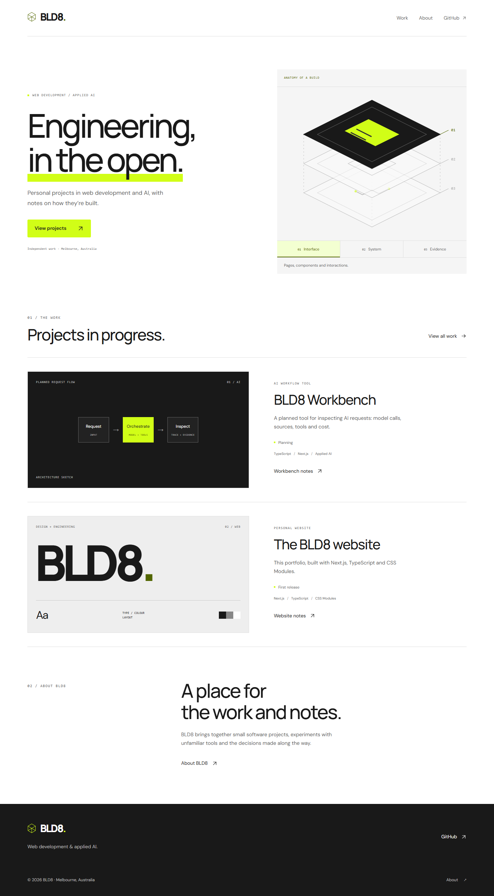

# BLD8 website

Personal software projects and notes by Jaison. Production domain: https://www.bld8.dev.

**Status:** first release deployed at [bld8-web.vercel.app](https://bld8-web.vercel.app).
Home, Work, About and two project pages are published. Workbench remains at the
documentation stage. Custom-domain DNS is pending; see [deployment details](docs/deployment.md).

## Run locally

Use Node 22.13+ (22.x) and npm. From this repository:

```powershell
npm ci
npm run dev
```

Open http://localhost:3108. For a production preview, run `npm run build`, then
`npm run start`. Commands bind to the local loopback address.

## Check the implementation

```powershell
npm run lint
npm run typecheck
npm test
npm run build
npx playwright install chromium
npm run test:e2e
```

Browser checks cover desktop (1440 px), mobile (360 px), navigation, keyboard
links, layer selection and native disclosures, missing pages, canonical URLs, horizontal overflow and automated
accessibility checks. A manual screen-reader pass is still needed before launch.
GitHub Actions runs these checks on pushes and pull requests.

## Structure

- `src/app/`: Home, Work, About, project details and metadata routes.
- `src/components/`: navigation, footer, project panels, the interactive layer study and project detail layouts.
- `src/styles/`: handwritten tokens, reset, global foundations and reduced-motion rules.
- `src/lib/site.ts`: public site identity, routes and project summaries.
- `tests/`: content integrity checks and browser smoke/accessibility checks.
- `docs/`: content inventory, design direction, brief and launch checklist.

Next.js App Router, TypeScript and CSS Modules. Fonts are self-hosted using
`next/font/local` and Fontsource packages; no Google Fonts fetch at build or runtime.
Dependencies are pinned through package-lock.json. No secrets are needed to run.

The Workbench application and private planning remain separate repositories.
See [site direction](docs/site-direction.md) and [launch checklist](docs/launch-checklist.md).

**Licence:** a source licence has not yet been selected. Bundled fonts retain their
upstream SIL Open Font License in their Fontsource packages.

## Preview


