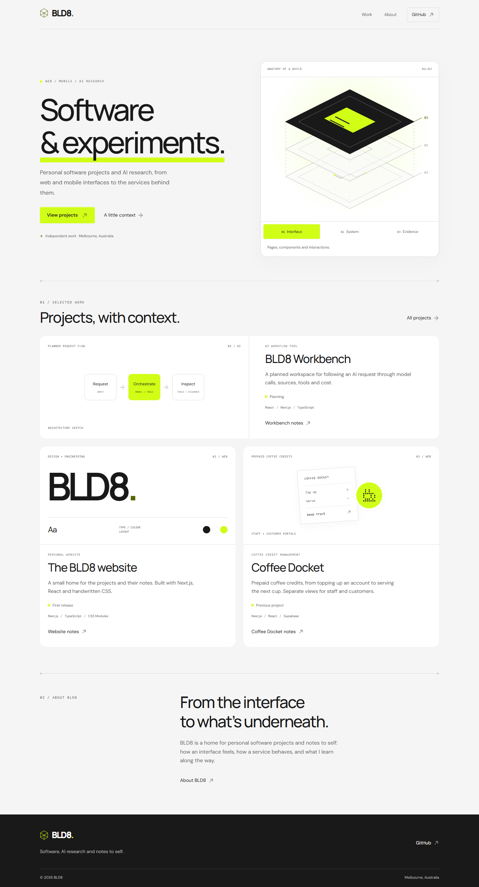

# BLD8 website

Personal software projects and notes by Jaison. Production domain: https://www.bld8.dev.

**Status:** live at [www.bld8.dev](https://www.bld8.dev).
Home, Work, About and four project pages are published, including the [BLD8 UI case study](https://www.bld8.dev/work/bld8-ui) and Coffee Docket
(release 9cf4541, 28 September 2026). Workbench remains at the documentation stage.
Custom-domain HTTPS and the root-to-www redirect are verified.
Pushes to main deploy automatically through the connected personal GitHub/Vercel
project; see [deployment details](docs/deployment.md).

## Current design

The 28 September refinement broadens the copy to .NET, C#, Angular, React,
Next.js, React Native, NestJS, Python and AI research, with a brighter minimal
design in the existing white/black/lime palette. Technology focus stays in
About-page prose; Home leads with projects. Controls use sharper corners and
subtle eased interactions, with fine rules marking sections. This refinement is now published alongside the BLD8 UI case study. Read
[the current direction](docs/site-direction.md) before continuing.

## Run locally

Use Node 22.13+ (22.x) and npm. From this repository:

```powershell
npm ci
npm run dev
```

Open http://127.0.0.1:3117. Keep the terminal running and save a source file;
changes refresh automatically. This port is now reserved for live development.

For a fresh production preview, run `npm run preview` and open port 3118.
`npm start` serves the last build and does not watch edits. Commands bind to
the local loopback address. See [local editing and file locations](docs/local-development.md).

## Check the implementation

```powershell
npm run lint
npm run typecheck
npm test
npm run build
npx playwright install chromium
npm run test:e2e
```

Browser checks cover desktop (1440 px), mobile (360 px), navigation, keyboard
links, layer selection and native disclosures, missing pages, canonical URLs, horizontal overflow and automated
accessibility checks. A manual screen-reader pass is still needed before launch.
GitHub Actions runs these checks on pushes and pull requests.

## Structure

- `src/app/`: Home, Work, About, project details and metadata routes.
- `src/components/`: navigation, footer, project panels, the interactive layer study and project detail layouts.
- `src/styles/`: handwritten tokens, reset, global foundations and reduced-motion rules.
- `src/lib/site.ts`: public site identity, routes and project summaries.
- `tests/`: content integrity checks and browser smoke/accessibility checks.
- `docs/`: content inventory, design direction, brief and launch checklist.

Next.js App Router, TypeScript and CSS Modules. Fonts are self-hosted using
`next/font/local` and Fontsource packages; no Google Fonts fetch at build or runtime.
Dependencies are pinned through package-lock.json. No secrets are needed to run.

The Workbench application and private planning remain separate repositories.
See [site direction](docs/site-direction.md), [launch checklist](docs/launch-checklist.md),
and [website structure and publishing](docs/website-structure.md).

**Licence:** a source licence has not yet been selected. Bundled fonts retain their
upstream SIL Open Font License in their Fontsource packages.

## Preview


